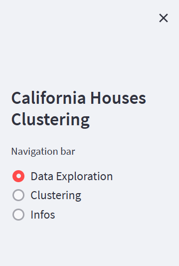

<h2>Project Screenshots:</h2>

 
  
  
  
  
  
  

<h2>🧐 Methodology</h2>

Here're some of the project's best features:

*   Find a good dataset to work on.
*   Explore the dataset to fully understand it.
*   Clean the data(remove duplicates, missing values...).
*   Use the DBSCAN model.
*   Evaluate the model.
*   Hyperparameter tuning.
*   Finaly plot the data after clustering.

  
<h2>🧐 Features</h2>

Here're some of the project's best features:

*   Data Exploration
*   Clustering using DBSCAN
    
<h2>💻 Built with</h2>

Technologies used in the project:

*   Python
*   Scikit-learn
*   Streamlit
*   Matplotlib
*   Pandas
*   Numpy
*   Seaborn
